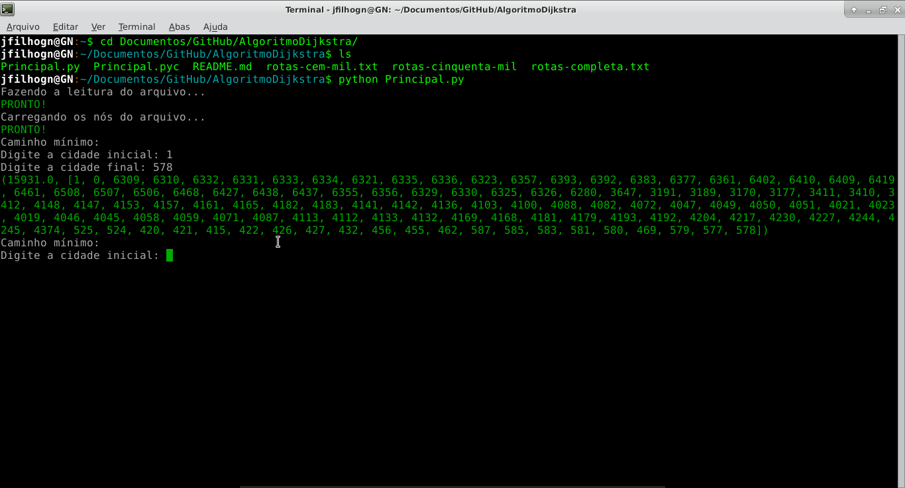

Implementação do Algoritmo de Dijkstra
---

Este projeto consiste na implementação do Algoritmo de Dijkstra para a disciplina de Teoria dos Grafos pelos alunos Luiz Felipe Fronchetti e João Martins Filho. O objetivo do projeto é localizar o menor caminho entre duas rotas determinada pelo usuário de cidades da Pensylvania.

As bases de dados foram extraídas do seguinte endereço: http://snap.stanford.edu/data/index.html

